# Multi-Agent Airbnb Planner System Documentation

## Overview

This system demonstrates a sophisticated multi-agent architecture using the Agent-to-Agent (A2A) protocol. It orchestrates three specialized agents to handle weather forecasts and accommodation searches through a unified conversational interface.

## System Architecture

> **🔧 PlantUML Setup**: To view PlantUML diagrams in VS Code, install the "PlantUML" extension and configure a PlantUML server. See setup instructions below the diagram.

```plantuml
@startuml
!theme plain
skinparam backgroundColor white
skinparam defaultFontSize 11

actor "👤\nUser" as User #lightblue
rectangle "🏠 Host Agent\n(Routing Agent)\nPort: 8083\n\nTechnologies:\n• Google ADK\n• A2A Protocol\n• Gradio UI" as Host #f3e5f5
rectangle "🌤️ Weather Agent\nPort: 10001\n\nTechnologies:\n• Google ADK\n• MCP Integration\n• Async Processing" as Weather #e8f5e8  
rectangle "🏨 Airbnb Agent\nPort: 10002\n\nTechnologies:\n• LangGraph\n• MCP Integration\n• React Agent Pattern" as Airbnb #fff3e0

cloud "☁️ National Weather\nService API" as NWS #lightcyan
cloud "☁️ Airbnb MCP Server\n@openbnb/mcp-server-airbnb" as AirbnbMCP #lightpink

User --> Host : "Tell me about weather in LA, CA"\n"Find a room in LA, CA"
Host --> Weather : Route weather queries\n(A2A Protocol)
Host --> Airbnb : Route accommodation queries\n(A2A Protocol)

Weather --> NWS : Weather data requests\n(MCP)
Airbnb --> AirbnbMCP : Accommodation searches\n(MCP)

NWS --> Weather : Weather forecasts & alerts
AirbnbMCP --> Airbnb : Listing data

Weather --> Host : Weather response\n(A2A Protocol)
Airbnb --> Host : Accommodation response\n(A2A Protocol)
Host --> User : Unified response

@enduml
```



### PlantUML Setup Instructions

Choose one of these options to render PlantUML diagrams:

#### Option 1: VS Code Extension (Recommended)
```bash
# Install PlantUML extension in VS Code
# Then add to your VS Code settings.json:
{
    "plantuml.server": "https://www.plantuml.com/plantuml",
    "plantuml.render": "PlantUMLServer"
}
```

#### Option 2: Local PlantUML Server
```bash
# Install Java (required for PlantUML)
brew install openjdk

# Install PlantUML
brew install plantuml

# Start local PlantUML server
plantuml -picoweb:8080

# Update VS Code settings to use local server:
{
    "plantuml.server": "http://localhost:8080",
    "plantuml.render": "PlantUMLServer"
}
```

#### Option 3: Docker PlantUML Server
```bash
# Run PlantUML server in Docker
docker run -d -p 8080:8080 plantuml/plantuml-server:jetty

# Update VS Code settings:
{
    "plantuml.server": "http://localhost:8080",
    "plantuml.render": "PlantUMLServer"
}
```

#### Option 4: Online Rendering
- Visit: https://www.plantuml.com/plantuml/uml/
- Copy the PlantUML code and paste it there for instant rendering

## Agent Details

### 🏠 Host Agent (Routing Agent)

**Purpose**: Central orchestrator that intelligently routes user queries to specialized agents

**Key Components**:
- **Technology Stack**: Google ADK + A2A Protocol + Gradio
- **Port**: 8083 (Web Interface)
- **File**: `host_agent/routing_agent.py`

**Capabilities**:
- Natural language query analysis
- Intelligent agent selection and routing
- Task coordination and response aggregation
- Session management and state tracking
- Web-based chat interface

**Core Features**:
- Maintains connections to remote agents
- Provides contextual information to downstream agents
- Handles multi-agent workflows seamlessly
- Error handling and graceful degradation

---

### 🌤️ Weather Agent

**Purpose**: Specialized agent for weather forecasting and alerts

**Key Components**:
- **Technology Stack**: Google ADK + MCP + National Weather Service API
- **Port**: 10001 (A2A Server)
- **Files**: 
  - `weather_agent/weather_agent.py` (ADK Agent)
  - `weather_agent/weather_mcp.py` (MCP Server)
  - `weather_agent/weather_executor.py` (A2A Executor)

**MCP Tools Available**:
- `get_forecast(latitude, longitude)` - Get detailed weather forecast
- `get_forecast_by_city(city, state)` - Get forecast by city name
- `get_alerts(state)` - Get active weather alerts by state

**Data Sources**:
- **National Weather Service (NWS) API**: Official US weather data
- **Nominatim Geocoding**: Convert city names to coordinates

**Response Format**:
- Multi-day forecasts with detailed conditions
- Temperature, wind, and precipitation data
- Active weather alerts and warnings
- Markdown-formatted responses

---

### 🏨 Airbnb Agent

**Purpose**: Accommodation search and booking assistance

**Key Components**:
- **Technology Stack**: LangGraph + MCP + Airbnb API
- **Port**: 10002 (A2A Server)
- **Files**:
  - `airbnb_agent/airbnb_agent.py` (LangGraph Agent)
  - `airbnb_agent/agent_executor.py` (A2A Executor)

**MCP Integration**:
- **External MCP Server**: `@openbnb/mcp-server-airbnb` (Node.js)
- **Server Config**: Runs via `npx` with `--ignore-robots-txt` flag

**Capabilities**:
- Property search by location and dates
- Guest capacity filtering
- Price and availability checking  
- Direct booking links
- Property details and amenities

**Response Features**:
- Structured property listings
- Direct links to Airbnb listings
- Comprehensive property information
- Error handling for unavailable properties

## Setup Instructions

### Prerequisites

```bash
# Required Software
- Python 3.13+
- Node.js (for Airbnb MCP server)
- uv (Python package manager)

# Install uv if not already installed
curl -LsSf https://astral.sh/uv/install.sh | sh
```

### Environment Configuration

#### 1. Weather & Airbnb Agent Configuration

Create `.env` files in both `weather_agent/` and `airbnb_agent/` directories:

```bash
# weather_agent/.env and airbnb_agent/.env
GOOGLE_API_KEY="your_google_api_key_here"
```

#### 2. Host Agent Configuration  

Create `.env` file in `host_agent/` directory:

```bash
# host_agent/.env
GOOGLE_GENAI_USE_VERTEXAI=TRUE
GOOGLE_CLOUD_PROJECT="your_google_cloud_project"
GOOGLE_CLOUD_LOCATION=global
AIR_AGENT_URL=http://localhost:10002
WEA_AGENT_URL=http://localhost:10001
```

### Starting the System

**Important**: Start agents in this specific order and use separate terminal windows.

#### Terminal 1: Weather Agent
```bash
cd samples/python/agents/airbnb_planner_multiagent/weather_agent
uv run .
```
*Expected output*: Server starts on port 10001

#### Terminal 2: Airbnb Agent
```bash
cd samples/python/agents/airbnb_planner_multiagent/airbnb_agent
uv run .
```
*Expected output*: Server starts on port 10002 with MCP server initialization

#### Terminal 3: Host Agent (Main Interface)
```bash
cd samples/python/agents/airbnb_planner_multiagent/host_agent
uv run .
```
*Expected output*: Gradio interface launches on port 8083

## How to Interact

### Accessing the Interface

1. **Open your browser** and navigate to: `http://localhost:8083`
2. **Interface**: Clean Gradio chat interface with A2A branding
3. **Features**: Real-time responses, tool call visibility, error handling

### Example Interactions

#### Weather Queries

**Basic Weather Request**:
```
User: "Tell me about weather in LA, CA"

System Response:
🛠️ Tool Call: send_message
⚡ Tool Response: Detailed weather forecast with:
- Current conditions
- 5-day forecast
- Temperature, wind, precipitation
- Formatted in markdown
```

**Weather Alerts**:
```
User: "Are there any weather alerts for California?"

System Response:
- Active weather warnings
- Severity and urgency levels
- Affected areas and timeframes
- Safety instructions
```

**Multi-City Weather**:
```
User: "Compare weather in New York and Miami"

System Response:
- Parallel queries to weather service
- Side-by-side forecast comparison
- Travel recommendations
```

#### Accommodation Queries

**Basic Accommodation Search**:
```
User: "Please find a room in LA, CA, June 20-25, 2025, two adults"

System Response:
🛠️ Tool Call: send_message  
⚡ Tool Response: Property listings with:
- Available properties
- Prices and ratings
- Direct Airbnb links
- Property amenities
- Location details
```

**Flexible Date Search**:
```
User: "Find accommodation in San Francisco for this weekend"

System Response:
- Current date-aware search
- Weekend availability
- Price range options
- Booking recommendations
```

**Group Accommodation**:
```
User: "Find Airbnb options in Miami for 6 guests, pool preferred"

System Response:
- Large capacity properties
- Amenity filtering
- Group-friendly options
- Cost per person calculations
```

#### Combined Multi-Agent Queries

**Travel Planning**:
```
User: "I'm planning a trip to Chicago. What's the weather like and what accommodation options are available?"

System Response:
- Weather agent provides forecast
- Airbnb agent suggests properties
- Coordinated travel advice
- Unified recommendation
```

**Conditional Planning**:
```
User: "If the weather is good in Seattle, find me a place to stay this weekend"

System Response:
- Weather evaluation first
- Conditional accommodation search
- Integrated decision making
- Complete travel package
```

## System Features

### 🔄 Real-Time Processing

- **Streaming Responses**: See responses as they're generated
- **Tool Call Visibility**: Watch agents call external services  
- **Error Recovery**: Graceful handling of service failures
- **Session Persistence**: Maintain conversation context

### 🛠️ Advanced Capabilities

- **Intelligent Routing**: Automatic query classification
- **Context Awareness**: Agents share relevant information
- **Parallel Processing**: Multiple agents can work simultaneously
- **Response Aggregation**: Unified presentation of multi-agent results

### 🔒 Security & Reliability

- **Input Validation**: Malicious input detection and sanitization
- **Rate Limiting**: Built-in API usage controls
- **Fallback Handling**: Alternative responses when services fail
- **Logging**: Comprehensive activity tracking

## Troubleshooting

### Common Issues

**1. Agent Connection Errors**
```bash
# Check if all agents are running
curl http://localhost:10001/health  # Weather agent
curl http://localhost:10002/health  # Airbnb agent
```

**2. Missing Environment Variables**
```bash
# Verify .env files exist and contain required keys
ls -la */.*env
cat weather_agent/.env
```

**3. Port Conflicts**
```bash
# Check for port usage
lsof -i :8083  # Host agent
lsof -i :10001 # Weather agent  
lsof -i :10002 # Airbnb agent
```

**4. MCP Server Issues**
```bash
# Test Airbnb MCP server manually
npx -y @openbnb/mcp-server-airbnb --ignore-robots-txt
```

### Performance Tips

- **Concurrent Queries**: System handles multiple simultaneous requests
- **Caching**: Repeated queries may return cached results
- **Timeout Handling**: Long-running queries have appropriate timeouts
- **Resource Management**: Automatic cleanup of connections and resources

## Technical Implementation Notes

### A2A Protocol Benefits

- **Standardized Communication**: Consistent agent-to-agent messaging
- **Security**: Built-in authentication and validation
- **Scalability**: Easy addition of new specialized agents
- **Monitoring**: Complete audit trail of inter-agent communications

### MCP Integration Advantages

- **Tool Standardization**: Unified interface for external services
- **Hot Reloading**: Update tools without restarting agents
- **Error Isolation**: Service failures don't crash entire system
- **Documentation**: Self-describing tool capabilities

### Architecture Benefits

- **Modularity**: Independent agent development and deployment
- **Specialization**: Each agent optimized for specific domains  
- **Fault Tolerance**: Single agent failure doesn't break system
- **Extensibility**: Easy addition of new capabilities and services

## Future Enhancements

- **Additional Agents**: Restaurant recommendations, transportation booking
- **Enhanced UI**: Map integration, visual property galleries
- **Mobile Support**: Responsive design for mobile devices
- **Voice Interface**: Speech-to-text integration
- **Multi-Language**: International travel support
- **Booking Integration**: Direct reservation capabilities

---

*This system showcases cutting-edge multi-agent AI architecture where specialized agents collaborate seamlessly to provide comprehensive travel planning assistance.*

